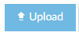
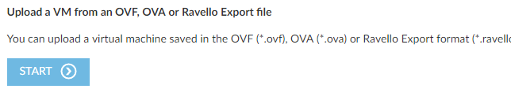
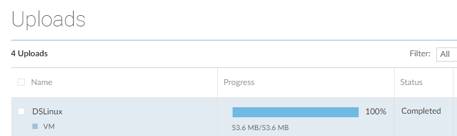
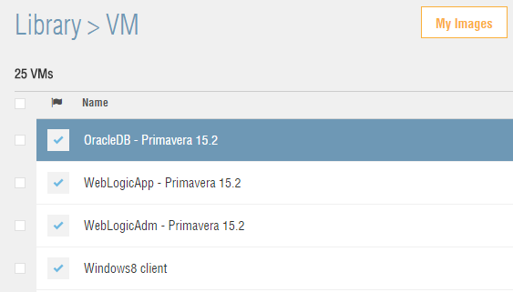

100
===================================

Oracle Ravello Introduction Workshop 
====================================

Contact: Matt Orsie (<matthew.orsie@oracle.com>)

January 4, 2017

Introduction
------------

[]{#_Toc6463460 .anchor}Ravello is an overlay cloud that enables enterprises to run their VMware and KVM workloads with DC-like (L2) networking ‘as-is’ on public cloud without any modifications. With Ravello, enterprises don’t need to convert their VMs or change networking. This empowers the business to rapidly develop and deploy existing DC applications on the public cloud without the associated infrastructure and migration cost and overhead.

This introductory lab is a modified version of the demo offered on Oracle GSE’s demo.oracle.com. A few extra steps have been added, and this guide will walk you through the process of creating a new Ravello Application based on a set of previously uploaded VMWare based VMs. Enterprise customers typically have many applications in their environment, and they need different environments for dev-test, etc. before rolling into production. In this lab, you will use an on-premises Oracle Primevera application comprised of four virtual images: Weblogic Admin, Weblogic App, Oracle DB and a Windows client. We will walk through how to replicate this setup on Ravello with a minimal number of clicks using these VM images imported from a data-center. []{#OLE_LINK8 .anchor}

### Objectives

-   Create a Ravello application

-   Connect into the environments

-   Create a “Blueprint” of the application

-   Create a new application from the “Blueprint”

### Required Artifacts

-   The following lab requires the end user to submit a request from demo.oracle.com for the necessary number of Ravello accounts. Registration for a workshop is requested from your demo.oracle.com account.

### Outline

[Introduction 2](#introduction)

[Objectives 2](#objectives)

[Required Artifacts 2](#required-artifacts)

[Outline 2](#outline)

[Student Lab Guide 3](#student-lab-guide)

[Uploading a VM into your Ravello library 3](#uploading-a-vm-into-your-ravello-library)

[Create Primavera Application 7](#create-primavera-application)

[Add and Modify new VM into Application 22](#add-and-modify-new-vm-into-application)

[Create a Blueprint of the Primavera Application 30](#create-a-blueprint-of-the-primavera-application)

Student Lab Guide
-----------------

**Use-case:** Oracle Primevera is running on VMware in a Data Center – We’d like to spin up copies of the four demonstration VMs in the cloud for dev-test.

### Uploading a VM into your Ravello library

During this lab, we will connect to Ravello, then we will upload required VMs into a library. This VM will be used in the following lab.

1.  Login to your account

Note: You will use the login URL and credentials supplied by the instructor.

-   Go to the Ravello Systems login page

https://cloud.ravellosystem.com/

-   Login your assigned Ravello account

1.  Upload your VM

The instructor will be providing you with a small custom Linux image exported from Oracle VirtualBox. This will be used in a Ravello application you will be creating.

During an import, you will be asked to download a lightweight Ravello Import Tool (runs on Windows, Mac and Linux), which subsequently installs and starts in a new browser tab. You have to **re-enter your username/password credentials for your account to do the import**.

**NOTE:** As a backup this VM has been placed in the public Ravello Repository. You can move it over to your library by clicking the **Ravello Repo** link at the top right of the web page, searching for “**DSL**” and clicking **Add to Library**. Give it the name **DSLinux**.

-   After logging in, go to the left-hand menu, click on **LibraryVM**. Then, click on the **Import VM** button.

-   Download and run the installation of the Ravello Import Tool. Select your host OS platform. (NOTE: There is also a Command Line version available which we won’t be using here)

-   After the tool is installed, you’re prompted to re-login to the Ravello account with your credentials.

-   The next screen shows any previous uploads. Click the **Upload** button.

-   Select the source VM for the import. In this lab, we are uploading an OVA file.

-   Click the **Start** button.

-   Browse to the OVA file location on your local server and select **Upload**. Once uploaded, the file will show in the uploaded section to be verified for inclusion into your local library. After it’s in the library, the VM can be used in a Ravello application.

### Create Primavera Application

1.  Verify the imported VM and Create a new Application

-   Go back to your original login session. If the Library of VMs window is not already opened, return by selecting **LibraryVM** Menu option. You should now see the DSLinux VM displayed. If possible during the import meta-data associated with imported VMs such as (number of CPUs, Memory, Networking, etc.) is brought into the environment. This is typical in the case of imported VMWare images. However, this is a custom non-VMWare image we imported so there is a minimum of meta-data available and some assumptions are made about its default setup.

-   The imported needs to be verified. For now, we will change some of the default settings and save any networking changes for later. With the DSLinux VM selected, click on the **Edit & Verify VM** button.

-   Click on the System tab and change the Platform to **Default** and the Display to **Standard VGA**

-   That’s all the changes to make for now. Click **Finish**.

-   In our library we see three VMs that contain the name **Primavera**, and another one that is titled **Windows8** **client**. These VMs will be used to create our application. The DSLinux VM will be added later.

-   Click on the **Applications** button, and then select **+Create Application**

 

-   Name the Application “**Primavera on Ravello**” and click **Create**.

-   Drag and drop the four **VMs** onto the **Canvas**.

-   Select the **OracleDB VM** on the canvas. Notice the information presented in the Summary tab. This information was gathered from the meta-data of the VM when it was imported. CPU, Memory, Disk Storage requirements and Login credential information is displayed for each VM.

-   Select the **General**, **System**, **Disks**, **NICs** and **Services** sections to display details of the VM. Here is where you could change/modify values before Publishing the application. In our example, the NICs tab for the OracleDB VM shows it is assigned a static IP address of 10.10.10.100:

-   The **Services** section is where you define any **External** access to the VM. In the case of the OracleDB, you can see that SSH access is opened on port 22, and access to the database is via port 1521.

-   Select the **Network** tab from the **Application Menu Bar** to look at the virtual subnets that will support this application. They are 10.10.10.0, 10.10.11.0 and 10.10.12.0:

-   Select the **Settings** tab from the **Application Menu Bar**

-   Since the Ravello applications run on metered accounts, you can determine how you want to run the application by comparing optimizations associated with the Cost and Performance options. These cost and performance options will vary depending on how many different underlying infrastructures support the deployment. (**The hardware components across the regions are the same. The cost is based on the price offered by the cloud provider for a given region. If you choose Cost, it will pick the cheapest region, whereas if you choose Performance, you get to choose which region that you want your application to be deployed on.\
    Performance = lower network latency running on your preferred location**). For our example, we’ll use the default setting of cost which chooses the least expensive of the underlying infrastructures. This is also where you could stipulate a specific start order of the VMs if there are dependencies upon one another.

1.  Publish the Application to the Cloud

-   Click **Publish**

-   You see a pop up allowing for confirmation of **Cost vs. Performance**. Leave the default set to **Cost.** Notice also that you can stipulate how long this application will run. The default is 2 hours. Click **Publish**.

-   Select the **Canvas** tab from the **Applications menu bar**

-   The VMs will show an hour glass while the underlying Cloud infrastructure for each VM is being provisioned. This typically takes 7-10 minutes to provision the infrastructure (Ravello Hypervisor running on hardware) and then starting up all of the VMs.

-   Once the underlying infrastructure environment is provisioned the Icons go green which means the VMs are now going through their normal startup period depending on what’s in the VMs.

1.  Connect to the VMs

-   Select the **OracleDB VM,** and then click the **Console** button at the lower right hand side of the page:

-   After entering the console, it may take a few minutes for the image fully start. Wait for the **login:** prompt to be displayed.

-   Login as the oracle OS user using:

Username: **oracle**

password: **ora123!**

-   Connect to the database using: **sqlplus sys/Welcome1@INDB as sysdba**

-   Back in the Application Canvas, click on the **WeblogicAdm – Primavera 15.2** VM. You will use the externally generated IP to get to the Weblogic Server Admin console. In this example, the external IP is 104.198.171.193. Ports 22, 7001 and 7002 have been opened for External access. This access is defined in the Services section for each VM

-   From your browser, open a new tab and enter the following URL substituting **&lt;your Public IP&gt;: (in this example 104.198.171.93)**

-   Enter **weblogic** for the Username and **Welcome1** for the password. Click **Login**.

-   The Weblogic Server console will be displayed:

-   Select the **Windows 8 client VM**, and click **Console**. (NOTE: The Services section for this VM has opened up port 3389 for Remote Desktop access to this server. You could use RDP from another Windows client using the Public IP for this server on port 3389 (In this example 104.155.171.241):

**Information Only**: RDP Client Example (username/password: **Ravello/Ravello**)

-   Once into the Windows server double click the **Instantis** desktop icon.

-   If you receive the message that the connection **Your is not private**, click on **Advanced**, and then click on the **Proceed to unit…** link.

-   Log into the application using Username: **vallen** and Password: **Welcome!** NOTE: you may see a warning when going to this URL, or you may be prompted to import a certificate depending on your browser. Accept any condition requests to continue.

-   The application should now be up and running. The browser running on the Windows 8 VM is using the WebLogic Server in your Application displaying data from the Oracle Database VM.

### Add and Modify new VM into Application

1.  Add a new VM into the Application

    Now we will add the **DSLinux** VM we uploaded at the beginning of this lab into the current application. We will also modify the networking so it’s on the same subnet as the WebLogicAdm and WebLogicApp servers. This will require the current definition to be changed from DHCP to Static IP in Ravello and also “within” the VM itself.

-   In the Canvas tab, drag and drop the **DSLinux** VM into the application:

-   Click on the **NICs** tab:

-   Click the **Static** radio button in the IP Information section.

-   Enter or select the following:

    -   **Name: eth0**

    -   **Uncheck the Auto MAC checkbox**

    -   **Device: e1000 (default)**

    -   **Static IP: 10.10.11.110**

    -   **Netmask: 255.255.255.0**

    -   **Gateway: 10.10.11.1**

    -   **DNS: 10.10.11.2**

When everything looks right, click the **Save** and then the **Update** button.

 

-   At this point **DSLinux** VM will be started as it is part of an already running application. In a few minutes the state icon will turn green.

-   Click on the **DSLinux** VM and select the application **Network** tab. Verify that the VM is in the same subnet as the other two Weblogic VMs (10.10.11.0):

-   Select the **DSLinux** VM and click the **Console** button. Login as: **root/oracle**

-   You will notice when the graphical interface comes up that the Cursor and Mouse Pointers are out of sync. This can be fixed by ether installing VMWare Tools (In the case of VMWare imported VMs but not applicable to this VM as it is non-VMWare based) or using RDP in the case of Windows. Another option for this and other non-supported custom images is that you could install VNC Server and connect into it that way. If a GUI interface is not required, then SSH’ing into the VM would be sufficient. More information can be found at:

https://support.ravellosystems.com/hc/en-us/articles/215218848-How-to-install-VMware-tools-on-Ravello-VM

-   **Close** the opened “Getting Started with DSL” window by clicking on the “**X**” in the upper right hand corner.

-   Next, we will add a network interface. Click on the **DSLpanel** icon and select **Netcardconfig**

 

-   Leave the “Interface” name as **eth0**, enter **10.10.11.110** as the “Address IP”, **10.10.11.1** as the “Gateway” and **10.10.11.2** as the first DNS entry. You can blank out the second DNS entry. When completed it should look like:

-   Click **Apply** and then **Exit**.

-   Open up a terminal window by clicking on the **ATerminal** icon.

-   Enter “**shutdown 0 -h**”. This will shut down the VM. Close the Console tab in the browser when you see: **Connection Error**.

    

-   Make sure the DSLinux VM is still selected and click the **Start** button.

-   When the VM has re-started open the **Console**.

-   Login as **root/oracle** and again close the default “Getting Started with DSL” window.

-   Verify that the new IP address is configured by opening a terminal window using the **ATerminal** icon and typing **ifconfig**. You should see the eth0 interface with the 10.10.11.110 IP address:

-   Go back to the Ravello application, select the “**WeblogicAdm – Primavera 15.2**” VM and find the internal IP address assigned to it. Select the **Summary** tab. It will be 10.10.11.101.

-   Back in the DSLinux VM console click the **Firefox** icon.

-   Type the following URL: <http://10.10.11.101:7001/console>

-   Enter **weblogic/Welcome1** as the credentials.

-   You have now configured a separate VM into the “Primavera on Ravello” application and this VM can now access other servers.

### Create a Blueprint of the Primavera Application

1.  Create a Blueprint of the Application

    A Blueprint is a snapshot of the application at a point in time. Blueprints can then be shared with other members/teams within the Ravello installation. You will now create a Blueprint, a NEW application based on that Blueprint, and then you will launch the new application.

-   Close any open consoles.

-   From the “**Primavera on Ravello**” application canvas, click the **Save as Blueprint** button

-   Notice the “-**bp**” suffix added to the name. Select the **No Shutdown:…** radio button, and then click **Create**.

1.  Create a new Application from a Blueprint

Blueprints are a very powerful feature of Ravello. Using Blueprints, Ravello provides the ability to spin up as many copies of an environment as required. Each application is its own sandbox, so there are no IP or Hostname conflicts. This capability is very effective for creating POC or Dev/Test deployments quickly.

-   From the left pane select **Applications,** and then click **+Create Application**

-   Name the application “**Primavera on Ravello from BP**”. Check the **From Blueprint** checkbox, and ensure selection of the blueprint you just created (i.e. **Primavera on Ravello-bp**). Click **Create**.

-   Click **Publish**

-   Accept the default **Cost** based as the “Optimized for,” and click **Publish**.

-   The new application will be up and running in 10 or so minutes. This lab is completed.
